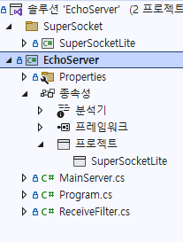
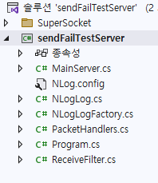
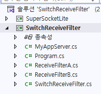
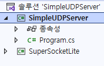
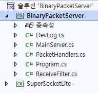
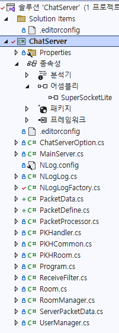
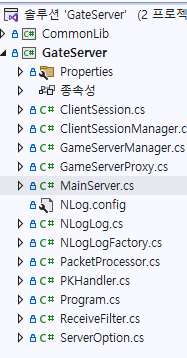

# Tutorial
여기에는 있는 서버를 순서대로 만들어 보면서 SuperSocketLite 사용 방법을 배운다.  
각 서버 프로젝트를 빌드하면 00_server_bins 디렉토리에 출력한다.  
    
  
## 중요
- 네트워크 이벤트 중 동일 세션이라도 `NewSessionConnected` 와 `NewRequestReceived` 다른 스레드에서 동시에 발생할 수 있다. 즉 클라이언트에서 접속하자말자 바로 패킷을 보내면 `NewSessionConnected`을 처리하는 중에 `NewRequestReceived`이 호출될 수 있다.
  
  
  
## EchoServer
      
  
- 가장 간단한 서버이다.
- 클라이언트가 보낸 것을 그대로 클라이언트에게 보낸다.
- 간단하게 SuperSocketLite를 애플리케이션에서 어떻게 사용하는지 배운다.  
- SuperSocketLite 라이브러리 프로젝트를 참조하고 있다.
  
- 빌드 후 run_EchoServer.bat 배치 파일로 실행한다.    
- 클라이언트는 EchoClient 프로젝틀 사용한다.  
  
   
## EchoServerEx
        
  
- [유튜브 영상](https://youtu.be/ZgzMuHE43hU )
- EchoServer를 좀 더 고도화 한 것이다.
- 서버 옵션을 프로그램 실행 시 인자로 받는다.
- NLog를 사용한다.
- SuperSocketLite 프로젝트를 참조하지 않고, SuperSocketLite를 빌드한 dll 파일을 참조한다.
  
### 프로젝트에 추가할 것 
- 00_superSocketLite_libs 디렉토리에 있는 dll을 추가한다.
- Nuget 추가 
    - CommandLineParser
	- NLog.Extensions.Logging
      
- 빌드 후 run_EchoServerEx.bat 배치 파일로 실행한다. 
- 클라이언트는 EchoClient 프로젝틀 사용한다.    
  
  
  
## EchoServer_GenericHost
          
  
- `EchoServer`에 `GenericHost` 기능을 사용하여 프로그램화 한 것이다.  
- 빌드 후 EchoServer_GenericHost.bat 배치 파일로 실행한다. 
- 클라이언트는 EchoClient 프로젝틀 사용한다.    
```
class Program
{
    static async Task Main(string[] args)
    {
        var host = new HostBuilder()
            .ConfigureAppConfiguration((hostingContext, config) =>
            {
                var env = hostingContext.HostingEnvironment;
                //config.SetBasePath(Directory.GetCurrentDirectory());
                config.AddJsonFile("appsettings.json", optional: true, reloadOnChange: true);
            })
            .ConfigureLogging(logging =>
            {
                logging.SetMinimumLevel(LogLevel.Debug);
                logging.AddConsole();
            })
            .ConfigureServices((hostContext, services) =>
            {
                services.Configure<ServerOption>(hostContext.Configuration.GetSection("ServerOption"));
                services.AddHostedService<MainServer>();
            })
            .Build();

        await host.RunAsync();
    }
}
```    
  
```
namespace EchoServer_GenericHost
{
    class MainServer : AppServer<NetworkSession, EFBinaryRequestInfo>, IHostedService
    {
        ...

        public MainServer(IHostApplicationLifetime appLifetime, IOptions<ServerOption> serverConfig, ILogger<MainServer> logger)
            : base(new DefaultReceiveFilterFactory<ReceiveFilter, EFBinaryRequestInfo>())
        {
            
        }

        public Task StartAsync(CancellationToken cancellationToken)
        {
            AppLifetime.ApplicationStarted.Register(AppOnStarted);
            AppLifetime.ApplicationStarted.Register(AppOnStopped);
                        
            return Task.CompletedTask;
        }

        public Task StopAsync(CancellationToken cancellationToken)
        {
            return Task.CompletedTask;
        }

        private void AppOnStarted()
        {
            AppLogger.LogInformation("OnStarted");
            
        }
```  
    
      
  
## MultiPortServer  
          
  
- 서버가 복수의 port 번호를 사용하는 경우에 대한 예제이다.  

```
class Program
{
    static void Main(string[] args)
    {
        Console.WriteLine("Hello SuperSocketLite");

        var serverOption = ParseCommandLine(args);
        if (serverOption == null)
        {
            return;
        }

        
        var server1 = new MainServer();
        server1.InitConfig(serverOption.Name1, serverOption.Port1, serverOption.MaxConnectionNumber1);
        server1.CreateServer();

        var IsResult = server1.Start();

        if (IsResult)
        {
            MainServer.MainLogger.Info("C2S 서버 네트워크 시작");
        }
        else
        {
            Console.WriteLine("[ERROR] C2S 서버 네트워크 시작 실패");
            return;
        }


        var server2 = new MainServer();
        server2.InitConfig(serverOption.Name2, serverOption.Port2, serverOption.MaxConnectionNumber2);
        server2.CreateServer();

        IsResult = server2.Start();

        if (IsResult)
        {
            MainServer.MainLogger.Info("S2S 서버 네트워크 시작");
        }
        else
        {
            Console.WriteLine("[ERROR] S2S 서버 네트워크 시작 실패");
            return;
        }


        MainServer.MainLogger.Info("key를 누르면 종료한다....");
        Console.ReadKey();
    }  
```  
   
- 빌드 후 run_MultiPortServer.bat 배치 파일로 실행한다. 
   
   
  
## sendFailTestServer 
          

- 서버는 연결된 클라이언트에 패킷을 보내었는데 클라이언트가 계속 받지 않아서 send가 타임 아웃이 발생한 경우를 테스트한 것이다  
  
```
class Program
{
    static void Main(string[] args)
    {
        ....

        var server = new MainServer();
        server.InitConfig(serverOption);
        server.CreateServer();

        var IsResult = server.Start();
        ...

        var timer = new Timer(64);

        timer.Elapsed += (s, e) =>
        {
            var packet = TempPacket();

            foreach (var session in server.GetAllSessions())
            {
                try
                {
                    session.Send(packet);
                }
                catch (TimeoutException ex)
                {
                    MainServer.MainLogger.Error($"{ex.ToString()},  {ex.StackTrace}");

                    // TimeoutException 발생 후 세션을 짜르고 싶으면 꼭 SendEndWhenSendingTimeOut()를 호출해야 한다.
                    session.SendEndWhenSendingTimeOut(); 
                    session.Close();
                    break;
                }
                catch (Exception ex)
                {
                    MainServer.MainLogger.Error($"{ex.ToString()},  {ex.StackTrace}");
                }
            }
        };

        ...
    }
```    
  
  
## SwitchReceiveFilter
            
  
- 연결되는 클라이언트 마다 서로 다른 `ReceiveFilter`를 적용하는 예를 보여준다. 
- 아래는 `SwitchReceiveFilter`에서 `ReceiveFilterA` 와 `ReceiveFilterB` 두개를 어떤 조건에 의해서 선택해서 사용하고 있다
```
public class MyAppServer : AppServer
{
    public MyAppServer()
        : base(new DefaultReceiveFilterFactory<SwitchReceiveFilter, StringRequestInfo>())
    {

    }
}


public class SwitchReceiveFilter : IReceiveFilter<StringRequestInfo>
{
    private IReceiveFilter<StringRequestInfo> m_FilterA;
    private byte m_BeginMarkA = (byte)'Y';

    private IReceiveFilter<StringRequestInfo> m_FilterB;
    private byte m_BeginMarkB = (byte)'*';

    public SwitchReceiveFilter()
    {
        m_FilterA = new ReceiveFilterA(this);
        m_FilterB = new ReceiveFilterB(this);
    }

    public StringRequestInfo Filter(byte[] readBuffer, int offset, int length, bool toBeCopied, out int rest)
    {
        rest = length;
        var flag = readBuffer[offset];

        if (flag == m_BeginMarkA)
            NextReceiveFilter = m_FilterA;
        else if (flag == m_BeginMarkB)
            NextReceiveFilter = m_FilterB;
        else
            State = FilterState.Error;

        return null;
    }

    public int LeftBufferSize { get; private set; }

    public IReceiveFilter<StringRequestInfo> NextReceiveFilter { get; private set; }

    public void Reset()
    {

    }

    public FilterState State { get; private set; }
}
```  
  


## SimpleUDPServer  
    
  
- UDP 통신을 하는 간단한 예제 코드
  
  

## TestMemoryPack
    
  
- 직렬화 라이브러리인 `MemoryPack` 사용 예제 코드 
- 네트워크 프로그램의 패킷으로 사용할 때의 코드도 있다  
```
void Test6()
{
    Console.WriteLine("[ Test 6 ] 패킷 데이터 직렬화");

    var reqPkt = new PKTReqLogin
    {
        TotalSize = 0, // 여기에서는 패킷의 전체 크기를 알 수 없다
        Id = 22,
        Type = 0,
        UserID = "jacking75",
        AuthToken = "jacking75",
    };
    // 직렬화 하면 앞에 1 바이트는 갯수, 이후는 데이터 순서대로 직렬화한다
    var bin = MemoryPackSerializer.Serialize(reqPkt);
    var totalSize = (UInt16)bin.Length;
    Console.WriteLine($"[Test6] Packet bin Size: {totalSize}");

    // PKTReqLogin 초기화에서 패킷의 전체 크기를 0으로 했기 때문에 올바르게 수정한다
    FastBinaryWrite.UInt16(bin, 1, totalSize);
    

    // 패킷 헤더 정보 읽기
    var headerInfo = new MemoryPackPacketHeadInfo();
    headerInfo.Read(bin);
    headerInfo.DebugConsolOutHeaderInfo();


    var obj = MemoryPackSerializer.Deserialize<PKTReqLogin>(bin);

    if (obj != null)
    {
        Console.WriteLine($"{obj.UserID}:{obj.AuthToken}");

        if (obj.Id == reqPkt.Id && obj.AuthToken == reqPkt.AuthToken)
        {
            Console.WriteLine("OK - Test6");
        }
    }
}
```  
  
```
[MemoryPackable]
public partial class PkHeader
{
    public UInt16 TotalSize { get; set; } = 0;
    public UInt16 Id { get; set; } = 0;
    public byte Type { get; set; } = 0;
}

// 로그인 요청
[MemoryPackable]
public partial class PKTReqLogin : PkHeader
{
    public string UserID { get; set; } = default!;
    public string AuthToken { get; set; } = default!;
}

[MemoryPackable]
public partial class PKTResRoomEnter : PkHeader
{
    public Int16 ErrorCode { get; set; }
    public int RoomNumber { get; set; }
}
```  
    
```
public struct MemoryPackPacketHeadInfo
{
    const int PacketHeaderMemoryPackStartPos = 1;
    public const int HeadSize = 6;

    public UInt16 TotalSize;
    public UInt16 Id;
    public byte Type;

    public static UInt16 GetTotalSize(byte[] data, int startPos)
    {
        return FastBinaryRead.UInt16(data, startPos + PacketHeaderMemoryPackStartPos);
    }

    public static void WritePacketId(byte[] data, UInt16 packetId)
    {
        FastBinaryWrite.UInt16(data, PacketHeaderMemoryPackStartPos + 2, packetId);
    }

    public void Read(byte[] headerData)
    {
        var pos = PacketHeaderMemoryPackStartPos;

        TotalSize = FastBinaryRead.UInt16(headerData, pos);
        pos += 2;

        Id = FastBinaryRead.UInt16(headerData, pos);
        pos += 2;

        Type = headerData[pos];
        pos += 1;
    }

    public void Write(byte[] mqData)
    {
        var pos = PacketHeaderMemoryPackStartPos;

        FastBinaryWrite.UInt16(mqData, pos, TotalSize);
        pos += 2;

        FastBinaryWrite.UInt16(mqData, pos, Id);
        pos += 2;

        mqData[pos] = Type;
        pos += 1;
    }

    
    public void DebugConsolOutHeaderInfo()
    {
        Console.WriteLine("DebugConsolOutHeaderInfo");
        Console.WriteLine("TotalSize : " + TotalSize);
        Console.WriteLine("Id : " + Id);
        Console.WriteLine("Type : " + Type);
    }   
}
```   
  

    
## BinaryPacketServer
     
  
- `ReceiveFilter`를 바이너리 포맷의 패킷으로 주고 받을 때의 예제 코드  
```
public class NetworkSession : AppSession<NetworkSession, EFBinaryRequestInfo>
{
}

void RequestReceived(NetworkSession session, EFBinaryRequestInfo reqInfo)
{
    DevLog.Write(string.Format("세션 번호 {0} 받은 데이터 크기: {1}, ThreadId: {2}", session.SessionID, reqInfo.Body.Length, System.Threading.Thread.CurrentThread.ManagedThreadId), LOG_LEVEL.INFO);
    
    var PacketID = reqInfo.PacketID;
    var value1 = reqInfo.Value1;
    var value2 = reqInfo.Value2;

    if (HandlerMap.ContainsKey(PacketID))
    {
        HandlerMap[PacketID](session, reqInfo);
    }
    else
    {
        DevLog.Write(string.Format("세션 번호 {0} 받은 데이터 크기: {1}", session.SessionID, reqInfo.Body.Length), LOG_LEVEL.INFO);
    }
}
```  
  
```
public class EFBinaryRequestInfo : BinaryRequestInfo
{
    public Int32 PacketID { get; private set; }
    public Int16 Value1 { get; private set; }
    public Int16 Value2 { get; private set; }

    public EFBinaryRequestInfo(int packetID, short value1, short value2, byte[] body)
        : base(null, body)
    {
        this.PacketID = packetID;
        this.Value1 = value1;
        this.Value2 = value2;
    }
}

public class ReceiveFilter : FixedHeaderReceiveFilter<EFBinaryRequestInfo>
{
    public ReceiveFilter()
        : base(12)
    {

    }

    protected override int GetBodyLengthFromHeader(byte[] header, int offset, int length)
    {
        if (!BitConverter.IsLittleEndian)
            Array.Reverse(header, offset + 8, 4);

        var nBodySize = BitConverter.ToInt32(header, offset + 8);
        return nBodySize;
    }

    protected override EFBinaryRequestInfo ResolveRequestInfo(ArraySegment<byte> header, byte[] bodyBuffer, int offset, int length)
    {
        if (!BitConverter.IsLittleEndian)
            Array.Reverse(header.Array, 0, 12);

        return new EFBinaryRequestInfo(BitConverter.ToInt32(header.Array, 0),
                                       BitConverter.ToInt16(header.Array, 0 + 4),
                                       BitConverter.ToInt16(header.Array, 0 + 6), 
                                       bodyBuffer.CloneRange(offset, length));
    }
}
```  
  


## ChatServer
  
  
- [유튜브 영상](https://youtu.be/eiwvQ8NV2h8 )
- 채팅 서버
- 패킷 처리는 1개의 스레드만으로 처리한다.

- 클라이언트는 `ChatClient` 이다. WPF로 만들었다
    
    

## ChatServerEx  
- 채팅 서버
- ChatServer와 달리 패킷 처리를 멀티스레드로 한다는 것만 빼고는 같음
    - 각 스레드 별로 접근할 수 있는 Room 객체를 할당한다
  
```
public PacketDistributor GetPacketDistributor() { return Distributor; }
        
void OnConnected(ClientSession session)
{
    //옵션의 최대 연결 수를 넘으면 SuperSocket이 바로 접속을 짤라버린다. 즉 이 OnConneted 함수가 호출되지 않는다

    session.AllocSessionIndex();
    MainLogger.Info(string.Format("세션 번호 {0} 접속", session.SessionID));
                
    var packet = ServerPacketData.MakeNTFInConnectOrDisConnectClientPacket(true, session.SessionID, session.SessionIndex);            
    Distributor.DistributeCommon(false, packet);
}

void OnClosed(ClientSession session, CloseReason reason)
{
    MainLogger.Info(string.Format("세션 번호 {0} 접속해제: {1}", session.SessionID, reason.ToString()));


    var packet = ServerPacketData.MakeNTFInConnectOrDisConnectClientPacket(false, session.SessionID, session.SessionIndex);
    Distributor.DistributeCommon(false, packet);

    session.FreeSessionIndex(session.SessionIndex);
}

void OnPacketReceived(ClientSession session, EFBinaryRequestInfo reqInfo)
{
    MainLogger.Debug(string.Format("세션 번호 {0} 받은 데이터 크기: {1}, ThreadId: {2}", session.SessionID, reqInfo.Body.Length, System.Threading.Thread.CurrentThread.ManagedThreadId));

    var packet = new ServerPacketData();
    packet.SessionID = session.SessionID;
    packet.SessionIndex = session.SessionIndex;
    packet.PacketSize = reqInfo.Size;            
    packet.PacketID = reqInfo.PacketID;
    packet.Type = reqInfo.Type;
    packet.BodyData = reqInfo.Body;
            
    Distributor.Distribute(packet);
}
```  
  
```
public class PacketDistributor
{
    ConnectSessionManager SessionManager = new ConnectSessionManager();
    PacketProcessor CommonPacketProcessor = null;
    List<PacketProcessor> PacketProcessorList = new List<PacketProcessor>();

    DBProcessor DBWorker = new DBProcessor();

    RoomManager RoomMgr = new RoomManager();


    public ERROR_CODE Create(MainServer mainServer)
    {
        var roomThreadCount = MainServer.ServerOption.RoomThreadCount;
        
        Room.NetSendFunc = mainServer.SendData;

        SessionManager.CreateSession(ClientSession.MaxSessionCount);

        RoomMgr.CreateRooms();

        CommonPacketProcessor = new PacketProcessor();
        CommonPacketProcessor.CreateAndStart(true, null, mainServer, SessionManager);
                    
        for (int i = 0; i < roomThreadCount; ++i)
        {
            var packetProcess = new PacketProcessor();
            packetProcess.CreateAndStart(false, RoomMgr.GetRoomList(i), mainServer, SessionManager);
            PacketProcessorList.Add(packetProcess);
        }

        DBWorker.MainLogger = MainServer.MainLogger;
        var error = DBWorker.CreateAndStart(MainServer.ServerOption.DBWorkerThreadCount, DistributeDBJobResult, MainServer.ServerOption.RedisAddres);
        if (error != ERROR_CODE.NONE)
        {
            return error;
        }

        return ERROR_CODE.NONE;
    }

    public void Destory()
    {
        DBWorker.Destory();

        CommonPacketProcessor.Destory();

        PacketProcessorList.ForEach(preocess => preocess.Destory());
        PacketProcessorList.Clear();
    }

    public void Distribute(ServerPacketData requestPacket)
    {
        var packetId = (PACKETID)requestPacket.PacketID;
        var sessionIndex = requestPacket.SessionIndex;
                    
        if(IsClientRequestPacket(packetId) == false)
        {
            MainServer.MainLogger.Debug("[Distribute] - 클라리언트의 요청 패킷이 아니다.");
            return; 
        }

        if(IsClientRequestCommonPacket(packetId))
        {
            DistributeCommon(true, requestPacket);
            return;
        }


        var roomNumber = SessionManager.GetRoomNumber(sessionIndex);
        if(DistributeRoomProcessor(true, false, roomNumber, requestPacket) == false)
        {
            return;
        }            
    }

    public void DistributeCommon(bool isClientPacket, ServerPacketData requestPacket)
    {
        CommonPacketProcessor.InsertMsg(isClientPacket, requestPacket);
    }

    public bool DistributeRoomProcessor(bool isClientPacket, bool isPreRoomEnter, int roomNumber, ServerPacketData requestPacket)
    {
        var sessionIndex = requestPacket.SessionIndex;
        var processor = PacketProcessorList.Find(x => x.관리중인_Room(roomNumber));
        if (processor != null)
        {
            if (isPreRoomEnter == false && SessionManager.IsStateRoom(sessionIndex) == false)
            {
                MainServer.MainLogger.Debug("[DistributeRoomProcessor] - 방에 입장하지 않은 유저 - 1");
                return false;
            }

            processor.InsertMsg(isClientPacket, requestPacket);
            return true;
        }

        MainServer.MainLogger.Debug("[DistributeRoomProcessor] - 방에 입장하지 않은 유저 - 2");
        return false;
    }


    public void DistributeDBJobRequest(DBQueue dbQueue)
    {
        DBWorker.InsertMsg(dbQueue);
    }

    public void DistributeDBJobResult(DBResultQueue resultData)
    {
        var sessionIndex = resultData.SessionIndex;

        var requestPacket = new ServerPacketData();
        requestPacket.Assign(resultData);

        DistributeCommon(false, requestPacket);            
    }

    bool IsClientRequestCommonPacket(PACKETID packetId )
    {
        if ( packetId == PACKETID.REQ_LOGIN || packetId == PACKETID.REQ_ROOM_ENTER)
        {
            return true;
        }

        return false;
    }

    bool IsClientRequestPacket(PACKETID packetId)
    {
        return (PACKETID.CS_BEGIN < packetId && packetId < PACKETID.CS_END);
     }
}
```   
       
- 클라이언트는 `ChatClient` 이다. WPF로 만들었다


## GateServer_GameServer 
    
    
- 분산 서버 아키텍처에서 `클라이언트` 와 `백엔드서버(예 게임서버)` 간의 통신을 담당하는 서버이다  
    - 클라이언트는 GateServer에 접속하고 요청을 보낸다
    - GateServer는 클라이언트 접속을 관리하고, 클라이언트의 요청을 적절한 게임서버에 보낸다
    - 게임서버는 직접 클라이언트와 패킷을 주고 받지 않고, 모두 GateServer를 통해서 한다
- GateServer 서버와 연결하는 게임서버는 만들어지지 않았다
  


## PvPGameServer
    
  
- PvP 게임서버를 목적으로 만든 것이다. 그러나 미완성되어 채팅서버와 거의 동일하다
    
- 클라이언트는 `PvPGameServer_Client` 이다
  


## GameServer_MoDedicated
  
    
- 게임 서버에서 게임 로직을 주도적으로 처리하는 게임서버이다  
- 게임서버가 게임로직을 업데이트 주기에 맞추어서 실행하는 경우를 가정한 서버이다.  
- async/await 방식으로 스레드를 동작시킨다  
- 일반적인 스레드풀 방식보다 CPU를 덜 사용. 50% 정도
- 간격을 짧게 주면 맞지 않음.간격을 크게 주면 거의 맞음
     


## GameServer_MoDedicated2 
  
  
- `GameServer_MoDedicated` 와 구조적으로 같은 것이다
- 게임로직 업데이트를 직접 스레드를 만들어서 실행한다
   
  
  